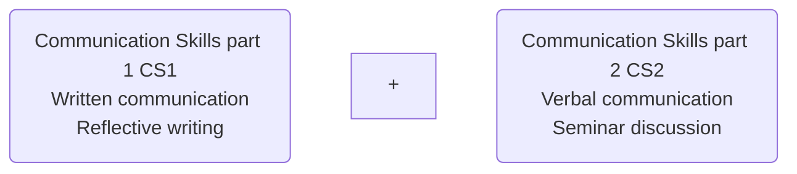
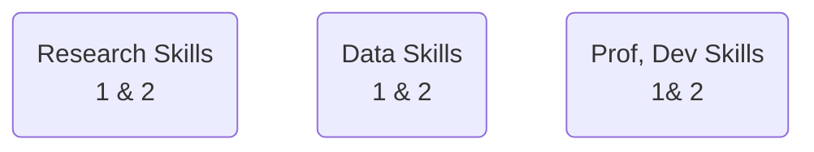

# Week 1: Module Introduction
## Session objectives: Week 1
>By the end of this session, you will have:
1. Discussed the themes, learning objectives and resources associated with the Communication Skills 1 (CS1) module.
2. Looked at the CS1 assessment details and marking criteria.
3. Learned how to access lesson materials, coursebook and other resources on VLE.
4. Shared existing knowledge about reflective writing using a game and discussion activity.
---
## CS1 module aims
>The CS1 module is designed to:
1. Teach you the basics of reflective practice and how to write a 1500-word reflective paper.
2. Prepare you for other modules at Level 3 and beyond.
3. Teach you how to effectively structure a paragraph and sections of longer written works.
4. Provide practical tips and guidance on electronic writing (e.g., formatting and structuring a Word document).

---

## How this module fits into your studies

- The module is designed to teach you how to write a reflective paper/practice, which will feature regularly throughout your studies and in wider contexts as well.
- To help you with this module, you’ll have sessions on paragraphing, cohesion & coherence, planning & draft writing, editing & proofreading, citations and referencing, and feedback.
- You’ll also have sessions on foundational concepts relating to academic writing such as formality and language.
- Lastly, you’ll have sessions involving practical digital writing skills, including MS Word.

---
## How this module fits into Level 3

> The 1st part of this module is designed to work in combination with the 2nd part scheduled for the second trimester of your Foundation year.

---
## How this module fits into Level 3

> The Communication Skills module is also designed to support, and be supported by your other foundational modules:  

---
## Employability and Reflective writing skills - 1

> Reflective writing can be considered a skill in-and-of itself (especially in graduate-level roles).
> You are expected to develop a host of related skills by the end of this module, including:
- Attention to detail
- Self-assessment and self-management skills
- Information structuring and team-working
- Language and formality skills
---
## Employability and Reflective writing skills - 2
- Describing, analysing and evaluating events / situations
- Interpretation and explanation skills
- Devising action plans
- Practical IT skills
- Time management skills
- Problem-solving skills and    
- Organisation skills
---

## Activity 1: Module info quiz 1 - Introduction
- Answer Activity 1 - Module Information Quiz 1 (Module aims + scope)

1. Which of these modules is Communication Skills 1 designed to work alongside?
    - a. Data Skills 1 & 2 
    - b. Research Skills 1 & 2
    - c. Professional Development 1 & 2
    - d. **Communication Skills 2** ✔
---
2. Which employability skills will be developed on this module?
    - a. Public speaking skills
    - b. Argumentation skills
    - c. Evidence-finding skills
    - d. Information structuring ✔
    - e. Self-assessment skills ✔
    - f. Meeting skills
    - g. Practical IT skills ✔
    - h. Attention to detail ✔
    - i. Devising action plans ✔
    - j. Language and formality skills ✔
    - k. Interpretation and explanation skills ✔
---
3. Pick the odd one(s) out.
    - a. Professional Development Skills
    - b. Business Management Skills ✔
    - c. Data Skills
    - d. Communication Skills
    - e. Research Skills
    - f. Personal Development Skills ✔
---
4. Why do you think this module (and the second part of this module) are named Communication Skills?
    - a. Because they help you communicate better on social media.
    - b. Because by the end of these modules, it is expected that you will have developed your written and verbal communication skills. ✔
    - c. Because they will definitely get you a job as you will have excellent communication skills by the end of these modules
    - d. Because the name ‘Communication Skills’ suits well with the names of the other modules.
---

## Assessment

### Task summary: 

#### Produce a 1500-word reflective writing that describes, evaluates, and analyses an aspect of your student life in ARUL. 

Choose only one of the following aspects of your ARUL student life for your reflective writing:
1. Materials and activities used in your lessons/lectures 
2. ARUL campus facilities and amenities
3. Involvement and participation in your lessons/lectures

> Following Gibbs’ 6-element reflective model  (covered in weeks 3 – 7 on the course), students are expected to reflect on the chosen aspect and produce a work that has the six elements namely Description, Feelings/thoughts, Evaluation, Analysis, Conclusion, and Action plan. 
---

## Assignment structure

|Section| Approximate Wordcount|
|-------|----------------------|
|1. Title page Module name & code, essay title, SID & wordcount|N/A|
|2. Content page|N/A| 
|3. Introduction| 150 words|
|4. Description of the chosen aspect|225 words|
|5. Feelings / thoughts|225 words|
|6. Evaluation|225 words
|7. Analysis|225 words|
|8. Conclusion|225 words|
|9. Action plan|225 words|
|10. References|N/A| 