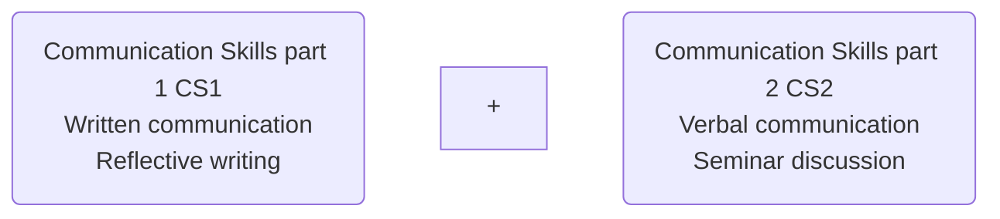
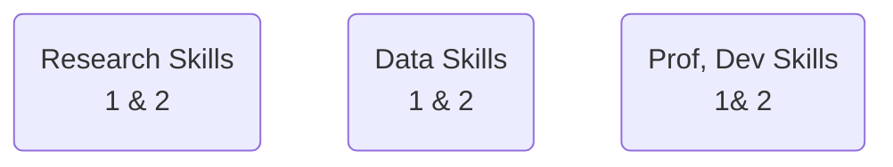

# Week 1: Module Introduction
- [Week 1: Module Introduction](#week-1-module-introduction)
  - [Session objectives: Week 1](#session-objectives-week-1)
  - [CS1 module aims](#cs1-module-aims)
  - [How this module fits into your studies](#how-this-module-fits-into-your-studies)
  - [How this module fits into Level 3](#how-this-module-fits-into-level-3)
  - [How this module fits into Level 3](#how-this-module-fits-into-level-3-1)
  - [Employability and Reflective writing skills - 1](#employability-and-reflective-writing-skills---1)
  - [Employability and Reflective writing skills - 2](#employability-and-reflective-writing-skills---2)
  - [Activity 1: Module info quiz 1 - Introduction](#activity-1-module-info-quiz-1---introduction)
  - [Assessment](#assessment)
    - [Task summary:](#task-summary)
  - [Assignment structure](#assignment-structure)
  - [|10. References|N/A|](#10-referencesna)
  - [Marking criteria - 1](#marking-criteria---1)
  - [Marking criteria - 2](#marking-criteria---2)
  - [Marking criteria - 3](#marking-criteria---3)
  - [Marking criteria - 4](#marking-criteria---4)
  - [Activity 2: Module info quiz 2 - Assessment](#activity-2-module-info-quiz-2---assessment)
  - [Activity 3: Module info quiz 3 - Resources](#activity-3-module-info-quiz-3---resources)
  - [Activity 4: Think-Pair-Share](#activity-4-think-pair-share)
  - [Game time - Kahoot](#game-time---kahoot)
  - [In-class writing practice](#in-class-writing-practice)
  - [Independent study](#independent-study)

## Session objectives: Week 1
>By the end of this session, you will have:
1. Discussed the themes, learning objectives and resources associated with the Communication Skills 1 (CS1) module.
2. Looked at the CS1 assessment details and marking criteria.
3. Learned how to access lesson materials, coursebook and other resources on VLE.
4. Shared existing knowledge about reflective writing using a game and discussion activity.
---
## CS1 module aims
>The CS1 module is designed to:
1. Teach you the basics of reflective practice and how to write a 1500-word reflective paper.
2. Prepare you for other modules at Level 3 and beyond.
3. Teach you how to effectively structure a paragraph and sections of longer written works.
4. Provide practical tips and guidance on electronic writing (e.g., formatting and structuring a Word document).

---

## How this module fits into your studies

- The module is designed to teach you how to write a reflective paper/practice, which will feature regularly throughout your studies and in wider contexts as well.
- To help you with this module, you’ll have sessions on paragraphing, cohesion & coherence, planning & draft writing, editing & proofreading, citations and referencing, and feedback.
- You’ll also have sessions on foundational concepts relating to academic writing such as formality and language.
- Lastly, you’ll have sessions involving practical digital writing skills, including MS Word.

---
## How this module fits into Level 3

> The 1st part of this module is designed to work in combination with the 2nd part scheduled for the second trimester of your Foundation year.

---
## How this module fits into Level 3

> The Communication Skills module is also designed to support, and be supported by your other foundational modules:  

---
## Employability and Reflective writing skills - 1

> Reflective writing can be considered a skill in-and-of itself (especially in graduate-level roles).
> You are expected to develop a host of related skills by the end of this module, including:
- Attention to detail
- Self-assessment and self-management skills
- Information structuring and team-working
- Language and formality skills
---
## Employability and Reflective writing skills - 2
- Describing, analysing and evaluating events / situations
- Interpretation and explanation skills
- Devising action plans
- Practical IT skills
- Time management skills
- Problem-solving skills and    
- Organisation skills
---
## [Activity 1: Module info quiz 1 - Introduction](/csweek1moduleintroduction/materials/Activity1ModuleInformationQuiz1ModuleAimsScope.md)
- Answer Activity 1 - Module Information Quiz 1 (Module aims + scope)
  - Activity 1: Module info quiz 1 - Introduction Answer Activity 1

## Assessment

### Task summary: 

> #### Produce a 1500-word reflective writing that describes, evaluates, and analyses an aspect of your student life in ARUL. 

Choose only one of the following aspects of your ARUL student life for your reflective writing:
1. Materials and activities used in your lessons/lectures 
2. ARUL campus facilities and amenities
3. Involvement and participation in your lessons/lectures

> Following Gibbs’ 6-element reflective model  (covered in weeks 3 – 7 on the course), students are expected to reflect on the chosen aspect and produce a work that has the six elements namely Description, Feelings/thoughts, Evaluation, Analysis, Conclusion, and Action plan. 
---

## Assignment structure

|Section| Approximate Wordcount|
|-------|----------------------|
|1. Title page Module name & code, essay title, SID & wordcount|N/A|
|2. Content page|N/A| 
|3. Introduction| 150 words|
|4. Description of the chosen aspect|225 words|
|5. Feelings / thoughts|225 words|
|6. Evaluation|225 words
|7. Analysis|225 words|
|8. Conclusion|225 words|
|9. Action plan|225 words|
|10. References|N/A| 
----
## Marking criteria - 1
 **Task fulfilment -25%**
- Providing relevant and supportive ideas
- Evidence of reflective practice / elements
- Evidence of learning and development and how this is put into practice
## Marking criteria - 2
**Coherence and cohesion – 25%**
- Overall organisation and logical progression
- Use of linking / signposting
- Focus and development of paragraphs
## Marking criteria - 3
**Language 25%**
- Range and accuracy of vocabulary 
- Range and accuracy of sentence structures
- Genre and formality
## Marking criteria - 4
**Academic conventions – 25%**
- Evidence of research and use of sources
- Standards of in-text citations and reference list
- Use of mechanics (spelling, formatting, punctuation etc.)
---
## [Activity 2: Module info quiz 2 - Assessment](/csweek1moduleintroduction/materials/Activity%202ModuleInformationQuiz%202(Assessment)Activity2.md)
---
 **Key module resources**

>### Module Information tile:
  - Scheme of work + resources list
  - CS1 contact list
>### Assessments & Guidance tile:
  - Assessment brief
  - Sample reflective paper(s)
  - Assessment submission link
>### Kortext (sidebar / app): 
---
## Activity 3: Module info quiz 3 - Resources
---
## Activity 4: Think-Pair-Share
> Think about your answers to the questions on the next slide for approximately 5 minutes.
- ###  Think-Pair-Share Qs
    1. What do you understand by ‘reflection?’
    2. Do you reflect? When and how often do you reflect? What are the benefits of reflecting?
    3. Is reflective practice a useful skill in academic world? Why/how?
    4. Why is reflective practice and reflective writing important for employability?
    5. Think of an important event/situation/thing you had/were/did in the past. Describe, evaluate and analyse it. How do you feel about it now? How differently would you do it again? (Note: You will use this for your Week 1 HW writing activity.)
## Game time - Kahoot
> **Listen to the instructions by the lecturer.**

## In-class writing practice
- Write/type a small paragraph of about 50-100 words on the following:
- How was the learning session today? What did you **enjoy?** What **could you have done better**? (10 minutes)
- After 10 minutes, work in pairs, exchange your paragraph with your partner and tell each other one good thing about their writing, and **one area they can do better next time**.

## Independent study

[Go to the ‘Independent study’ section under Week 2 tile.](IndependentstudyWeek1Writingactivity.md)

1. [READ: Read pp 2-6 on Kortext (PDF uploaded on VLE)](pp.2-6ofReflectiveWritingPDF.pdf)
2. ANSWER: Homework Quiz – on VLE (to be taken after the reading above)
3. [WRITE: Week 2 Independent Study Writing Activity](/csweek2GibbsModel%26Introduction/Independentstudy-Week2writingactivity.md)
5. [WATCH: Videos in ‘Week 2 Preparation Resources](https://youtu.be/-gbczr0lRf4)
