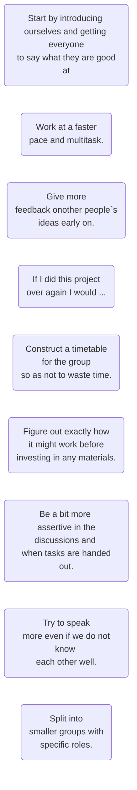
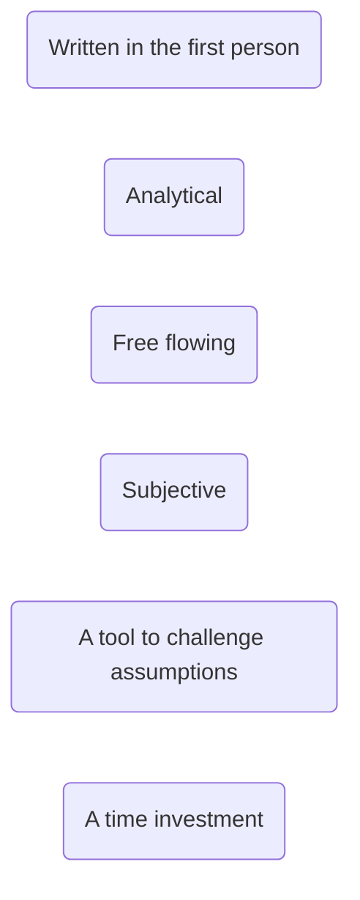

- [About reflection](#about-reflection)
- [Why reflect?](#why-reflect)
- [Reflection for life](#reflection-for-life)
- [Starting out on reflection](#starting-out-on-reflection)
- [Notes](#notes)

##  About reflection
Reflection starts with thinking about something. As Jenny Moon (2005 p. 1) observes, we don’t reflect on ‘simple’ things like the route to the corner shop, but on ***things for which there is not an obvious or immediate solution’.**

You could say that reflection is not about what you’re going to have for dinner this evening as you whizz round the shops. But it could be. If you are thinking about who will be eating it, what happened last time, then something as apparently simple as a shopping list could involve a lot of reflection.

It is not just to do with the subject matter of what you are thinking about or learning,
but how you think about it and how you learn.

Being reflective involves being:
- **open** to different ideas, seeing things from different angles
- **curious** – asking questions
- **patient** – if the issue is not ‘simple’, the answer probably isn’t either (although it
can suddenly jump out at you)
- **honest** with yourself, your uncertainties, what you’re getting wrong – or right – and
your writing needs to make this transparent to others, so they can see it too
- **rigorous** – being analytical, and acting on the insights you gain.

## Why reflect?

A very good reason to reflect is because it helps you to learn.
Students on an MA course explained what they learnt through reflection:

> ## Reflection has helped me recognise ...
---
- Patterns and routines that weren’t really helpful. I have started to think more
carefully about how and why I do things, and change them if they aren’t working.
- My own strengths that I hadn’t appreciated before. It has given me a lot more
confidence.
- Why my writing wasn’t improving. I wasn’t reading feedback carefully enough.
---
Reflection in a programme of study or a professional context is a purposeful activity.
Purposeful reflection can change how we think about things, what we do, how we do
it, and can lead to specific changes in planning for what we do next.

## Reflection for life
The power of reflection in learning doesn’t stop after studies. Increasingly, employers
and professions encourage people to become ‘reflective practitioners’. Reflecting
on an experience and learning from it is the basis of professional and personal
development that continues throughout life (see Part 6).

## Starting out on reflection
The following illustration shows some of the outcomes of the reflections on a group
task of some Product Design students in the first weeks of their course.

---
## Notes

| Reflective writing is...|             
|-------------------------|

| Reflective writing is...|             
|-------------------------|
